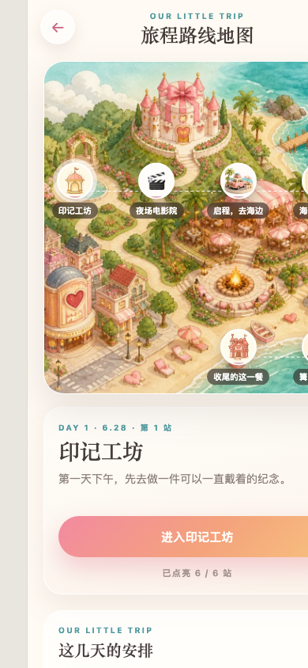
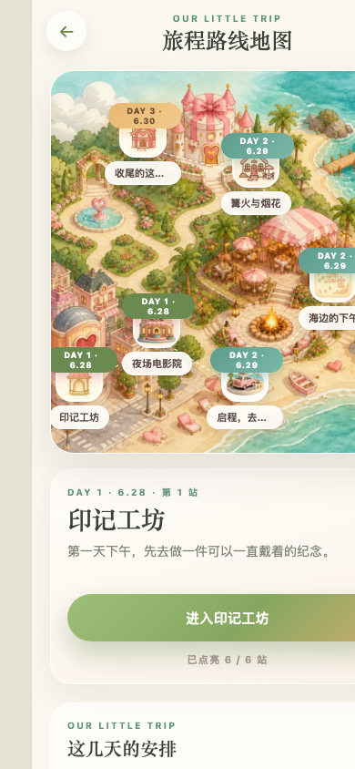
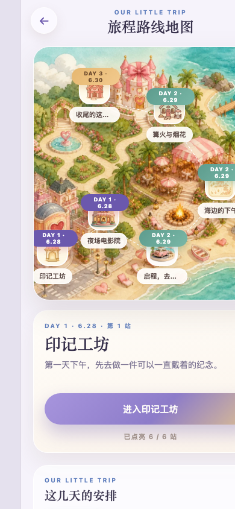
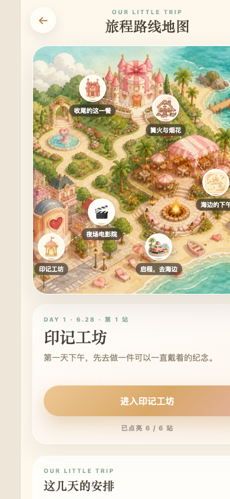
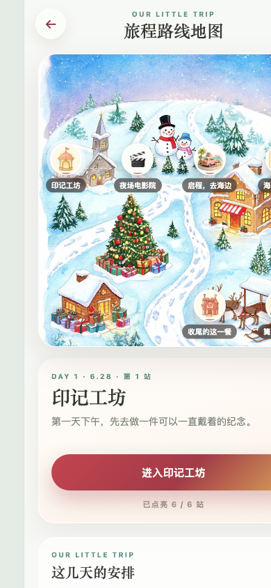

# Birthday Trip Surprise 🎈

一个**不用写代码**就能做的「惊喜旅程」互动网页：选主角、挑风格、写（或让 AI 写）行程文案、放照片，导出成品——把成品文件发给 TA，对方打开就能一站一站解锁你们的故事：地图逐站点亮、骰子小游戏、终章惊喜、照片回忆册。

- ✅ 纯本地制作向导：双击即用，无需安装、无需联网、不上传任何数据
- ✅ 成品是**一个自包含 .html 文件**：照片全部内嵌，发给 TA 双击/浏览器打开即可
- ✅ 内置 5 套风格主题（海边暖沙 / 森林 / 星光夜 / 新婚燕尔 / 圣诞颂歌），每套自带配套水彩导览地图
- ✅ 成对小人：封面落款 + 地图上沿路线一站站走的主角，内置 5 套套装，也能换成你自己的照片
- ✅ 音乐为浏览器内置合成（Web Audio），零外部依赖
- 本仓库示例素材均为可替换的演示资源，不含真实人物照片与视频

## 🎨 效果预览

同一份旅程的五种风格主题，选风格会同步配套各自的地图背景（标记可换成任意 emoji 或你上传的贴纸）：

| 海边暖沙 | 森林 | 星光夜 |
| --- | --- | --- |
|  |  |  |

| 新婚燕尔（地点式地图背景） | 圣诞颂歌（地点式地图背景） |
| --- | --- |
|  |  |

## ✨ 3 分钟上手

**① 打开制作向导**

- macOS：双击 `start.command`；Windows：双击 `start.bat`（需要 Python）。
- 或直接双击 `builder/index.html`（Chrome / Edge 下最稳；个别浏览器对本地网页有限制时请用启动器）。

**② 一步步做**

1. **开始**：从「示例旅程」开始改（推荐），或从空白搭建；
2. **主角与封面**：名字、日期、标题、封面图、落款、成对小人（5 套内置套装或你自己的照片）、旅程天数（可自定义到 21 天）、**选风格**（5 套主题卡，换风格会配套地图背景）；
3. **行程与文案**：一站站编排——站名、正文故事、心情、小任务、骰子卡片提示、地图图标（**预设 / 输入 emoji / 收藏贴纸任选**）、章节大图、地图标记样式（图钉 / 卡片）与站点校准、照片墙（手机相册或本地，自动压缩）；
4. **AI 助手**：口述行程让 AI 起草——可直连对话（实验性，支持 DeepSeek / OpenAI / 智谱 / Kimi / 通义 / Ollama 等，Key 仅存本机），也可复制提示词发给任意 AI、把返回 JSON 粘贴导入（零 Key）；
5. **预览与导出**：实时预览 → 导出单个 `.html`，发给 TA。

草稿自动保存在浏览器本地，关掉再打开可继续。成品另可部署到任意静态托管（GitHub Pages 等）长期在线。

> 不会写文案？看 [`docs/writing-guide.md`](docs/writing-guide.md)，里面有写法要点和可直接复制的 AI 提示词模板。

## 🤝 请朋友帮忙验收

想让朋友帮忙过一遍完整流程，直接把 Release 的 zip 发过去：

1. 下载 [`v1.0.0` 源码 zip](https://github.com/chenyufeng0127-cell/birthday-trip-surprise/archive/refs/tags/v1.0.0.zip) 并解压；
2. 双击 `start.command`（macOS）/ `start.bat`（Windows，需 Python 3），浏览器会自动打开制作向导；
3. 对照 [`docs/acceptance-checklist.md`](docs/acceptance-checklist.md) 逐项打勾：A 向导 10 项 → B 成品 5 项 → C 换设备（可选）。

哪一步不符合预期，请记录**屏幕上的提示原文 + 浏览器/设备**发回即可。

> 想换掉内置小人？看 [`docs/avatars-guide.md`](docs/avatars-guide.md)——角色卡 + 各主题换装提示词，可直接拿去即梦等工具生成，再替换 `assets/avatars/` 里的图。

## 🏗 仓库结构

```text
birthday-trip-surprise/
├── index.html / config.js / app.js / styles.css   # 成品引擎（根目录也是可直接打开的示例成品）
├── assets/
│   ├── ai/ icons/ map/ avatars/ photos/sample/    # 内置示例素材（AI 生成/占位，均可替换）
│   └── photos/                                    # 你的个人照片目录（git 忽略）
├── builder/                                       # ★ 制作向导（免写代码）
│   ├── index.html / builder.js / builder.css / builder-media.js
│   └── template.inline.js                         # 引擎内联资源（脚本自动生成）
├── docs/writing-guide.md                          # 文案写作指南
├── docs/avatars-guide.md                          # 小人形象与各主题换装提示词
├── docs/acceptance-checklist.md                   # 全流程验收清单
├── scripts/build-template.py                      # 重新生成 template.inline.js
├── start.command / start.bat                      # 一键启动器
└── LICENSE
```

**高级用法**：也可以不动向导，直接编辑根目录 `config.js`（主题/主角/站点/照片清单）后打开 `index.html`——引擎与向导生成的是同一套配置。

## 🔒 隐私与安全

- 本仓库不会也不应包含任何真实人物照片/视频；`.gitignore` 做了硬性拦截。内置地图与小人都是可替换的演示素材。
- 向导中的草稿、照片、AI Key 全部只保存在使用者自己的浏览器里，不上传任何服务器。
- 请把你自己的个人素材保存在本地或私有仓库；公开发布前自行核对。

## 🔧 开发者备注

- 修改成品引擎（根目录 `styles.css` / `app.js` / `config.js`）或内置素材后，运行 `python3 scripts/build-template.py` 重新生成向导内联资源。
- 成品调试：`?preview=1`（全解锁）、`?view=chapter&stop=2`、`?selftest=1`（回归自检）、`?theme=forest`（换主题预览）。
- 向导自检：`builder/?selftest=1`、`builder/?e2e=1`（导出产物实跑验证）。
- 零运行时依赖：纯 HTML / CSS / JS；适配移动端优先。

## 📄 License

**双许可**（全文见 [LICENSE](LICENSE)）：

- **个人与非商业用途：免费。** 按 PolyForm Noncommercial License 1.0.0 使用、修改、分享——做出来欢迎[告诉我一声](https://github.com/chenyufeng0127-cell/birthday-trip-surprise/issues)，比起 star，我更想看到你的版本和踩到的坑。
- **商业用途：需另行取得授权。** 企业内部使用、SaaS、付费产品、代客交付等场景，欢迎通过 [Issues](https://github.com/chenyufeng0127-cell/birthday-trip-surprise/issues) 或 GitHub [@chenyufeng0127-cell](https://github.com/chenyufeng0127-cell) 联系作者洽谈合作与授权。

仓库内的示例插画/图标/占位图为本项目内置示例素材；你在向导中上传的素材归属各制作者本人。
